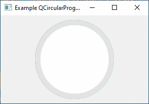

# PyQt6 Circular Progress Bar

A customizable circular progress bar widget for PyQt6 applications. This widget can be easily integrated into any PyQt6 application and customized in terms of colors, text, and appearance.



## Features

- Customizable colors, text, and appearance
- Smooth progress animations
- PyQt6 compatible
- Licensed under GNU General Public License v3.0

## Installation

To use this widget, simply copy the `QCircularProgressBar.py` file to your project directory and import the `QCircularProgressBar` class.

## Usage

Import the `QCircularProgressBar` class and add it to your application as a widget. You can customize the appearance of the progress bar by setting its properties and using style sheets.

Example:

```python
from QCircularProgressBar import QCircularProgressBar

# ...

app = QApplication(sys.argv)
main_window = QMainWindow()

# Create a QCircularProgressBar instance
progress_bar = QCircularProgressBar()

# Customize appearance using properties
progress_bar.setValue(50)
progress_bar.setFormat("Loading...")

# Add the progress bar to your layout
layout = QVBoxLayout()
layout.addWidget(progress_bar)
central_widget = QWidget()
central_widget.setLayout(layout)
main_window.setCentralWidget(central_widget)

# ...

sys.exit(app.exec())
```
For a more detailed example, see the ProgressBarExample class in the `QCircularProgressBar.py` file.

## License
This project is licensed under the GNU Lesser General Public License v3.0. See the [LICENSE](LICENSE) file for details.
